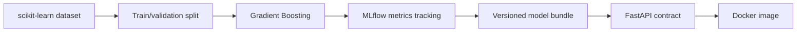

# MLflow Model Serving API

An end-to-end MLOps project connecting model experimentation with an actual serving contract. The workflow trains a reproducible classifier, records the run with MLflow, packages the selected model, and serves predictions through a Dockerized FastAPI application.

## Pipeline



## Design priorities

- Deterministic split and documented model configuration
- Metrics persisted both in the model bundle and MLflow
- Feature names and class labels travel with the model
- Typed API request and response contracts
- Health endpoint for orchestration checks
- Container builds the model from source instead of relying on an opaque committed pickle
- Unit tests cover training quality and inference shape

## Local workflow

```bash
python -m venv .venv
source .venv/bin/activate
pip install -r requirements.txt

python -m src.train --output artifacts/model.joblib
uvicorn app:app --reload
```

Example request:

```bash
curl -X POST http://localhost:8000/predict \
  -H 'Content-Type: application/json' \
  -d '{"records":[[13.2,2.7,2.5,18.5,99,2.6,2.3,0.3,1.8,5.2,1.0,3.0,1050]]}'
```

## Docker

```bash
docker build -t mlflow-model-api .
docker run -p 8000:8000 mlflow-model-api
```

## Data

The training workflow uses the public Wine classification dataset included with scikit-learn. Credentials and generated model artifacts are excluded from version control.
